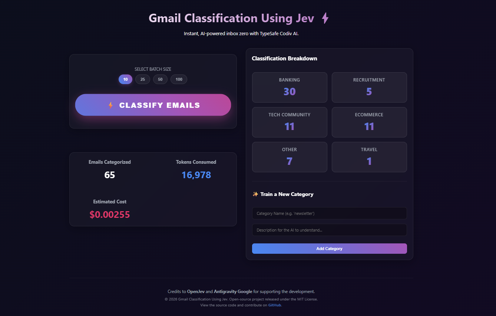

# Gmail Classification Using Jev ⚡📧



An intelligent, full-stack email automation tool that leverages the Gmail API and the **TypeSafe SDK** (Codiv AI) to automatically categorize, label, and archive incoming emails. Keep your inbox zeroed out by routing emails into smart categories with zero manual intervention.

---

## 🌟 Features

- **Hyper-Fast System One AI**: Utilizes TypeSafe's "System One" architecture powered by the `openjev-latest` model. This is a non-generative semantic routing approach that classifies emails instantly with near-zero latency, saving massive LLM token costs.
- **Premium Dashboard UI**: A state-of-the-art, glassmorphism-inspired React web application. Features dynamic micro-animations, a clean two-column layout, and a gorgeous real-time progress tracker.
- **Real-Time Cost Tracking**: Monitors exact token usage and dynamically calculates estimated financial cost for transparency.
- **Progress & ETA Engine**: While processing bulk batches of emails, the dashboard provides a live, calculated ETA (Estimated Time of Arrival) so you know exactly how long the task will take.
- **Dynamic Category Training**: Add new custom categories and descriptions directly from the UI to teach the AI how to handle niche email subjects.
- **Persistent State**: Maintains a live count of all emails categorized across sessions using robust local file state and professional standard rotating logs.
- **Auto-Labeling & Archiving**: The backend dynamically creates Gmail labels and archives messages straight out of your inbox in the background.

## 🛠 Project Structure

```text
├── frontend/                 # Vite + React UI Dashboard
│   ├── src/App.jsx           # Core SaaS layout and classification logic
│   └── src/App.css           # Premium glassmorphism & gradients styling
├── main.py                   # FastAPI robust backend server
├── classify_mails.py         # Core TypeSafe System One integration
├── pull_emails.py            # Gmail API OAuth and fetching logic
├── label_emails.py           # Gmail API labeling and archiving
├── logger.py                 # Enterprise-grade rotating file logger
├── state.json                # Persistent data store for dashboard metrics
├── GMAIL_API_SETUP.md        # Documentation for Google Cloud / OAuth setup
├── TYPESAFE_API_SETUP.md     # Documentation for Codiv API key generation
└── RUN_WEBAPP.md             # Guide on booting the full-stack system
```

## 📋 Prerequisites

- **Python 3.12+** and **Node.js**
- **uv**: Lightning-fast Python package installer.
- **pnpm**: Fast, disk space efficient package manager for Node.js.
- **Google Cloud Console Account**: For generating Gmail API OAuth credentials.
- **Codiv AI Account**: For generating the `TYPESAFE_API_KEY`.

## 🚀 Installation & Setup

1. **Clone the repository** and install Python dependencies:
   ```bash
   uv sync
   ```

2. **Install Frontend dependencies**:
   ```bash
   cd frontend
   npx pnpm install
   cd ..
   ```

## ⚙️ Configuration

1. **Gmail API**: Place your `credentials.json` in the root folder. (See [GMAIL_API_SETUP.md](./GMAIL_API_SETUP.md)).
2. **TypeSafe API**: Create a `.env` file in the root folder:
   ```env
   TYPESAFE_API_KEY="sk-codiv-YOUR_API_KEY"
   TYPESAFE_BASE_URL="https://api.codiv.ai"
   ```

## 💻 Running the Web App

To launch the full-stack classification dashboard, you need to run both the backend API and the frontend UI.

**1. Start the Backend API (FastAPI)**
```bash
uv run uvicorn main:app --reload
```

**2. Start the Frontend UI (Vite)**
In a new terminal window:
```bash
cd frontend
npm run dev
```

Open `http://localhost:5173` in your browser. Select your batch size using the sleek chips, click the **⚡ CLASSIFY EMAILS ⚡** mega button, and watch your inbox get automatically organized!

## 📜 Credits & License
This project would be impossible without the incredible support and technology from:
- [**Codiv AI (TypeSafe SDK)**](https://codiv.ai): The backbone of our lightning-fast System One routing architecture.
- **OpenJev**: For providing the optimized, zero-shot semantic classification model.
- **Antigravity Google**: For continuously supporting and enabling the development of this project.

Released under the MIT License.
